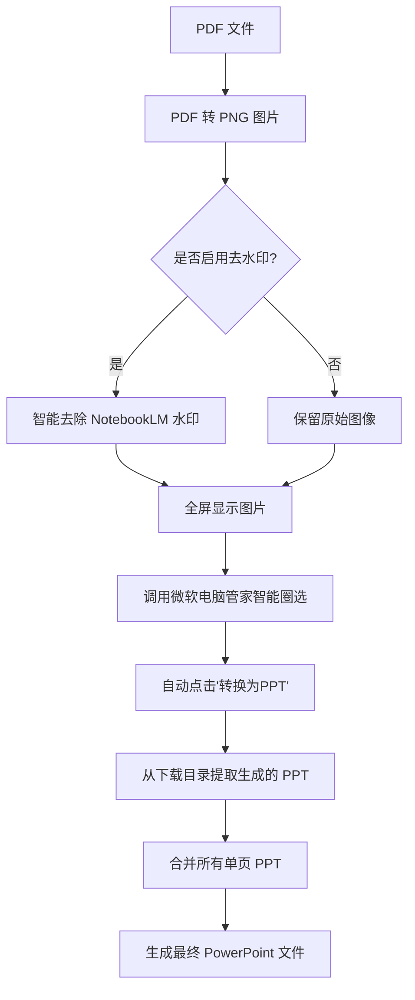

# 🚀 NotebookLM2PPT - 将 PDF 转换为可编辑 PowerPoint 的自动化工具

## 📝 项目简介

**NotebookLM2PPT** 是一款强大的自动化工具，旨在将不可编辑的 PDF 文档（特别是 [NotebookLM](https://notebooklm.google.com/) 生成的演示文稿）转换为**完全可编辑**的 PowerPoint 演示文稿。

### 💡 核心价值

- **打破限制**：将 NotebookLM 生成的精美但不可编辑的 PDF 转化为可二次创作的 PPT。
- **智能去水印**：内置针对 NotebookLM 的智能水印去除算法。
- **全自动化**：利用微软电脑管家的“智能圈选”功能，自动完成截图、识别、转换和合并的全流程。
- **通用性**：不仅限于 NotebookLM，适用于任何需要将 PDF 转换为可编辑 PPT 的场景。

---

## 🛠️ 工作原理

本工具通过模拟人工操作，实现了一套高效的转换流程：



---

## ✨ 主要功能

- 📄 **高质量转换**：使用 [src/pdf2png.py](src/pdf2png.py) 确保 PDF 到图片的无损转换。
- 🖼️ **智能修复**：[src/utils/image_inpainter.py](src/utils/image_inpainter.py) 自动识别并抹除 NotebookLM 的特定水印。
- 🤖 **自动化流程**：[src/utils/screenshot_automation.py](src/utils/screenshot_automation.py) 负责模拟快捷键和鼠标点击，实现无人值守操作。
- 🔄 **无缝合并**：[src/ppt_combiner.py](src/ppt_combiner.py) 将零散的幻灯片完美整合。
- ⚙️ **高度可定制**：支持 DPI、延迟、显示比例等多种参数微调。

---

## 🚀 快速开始

### 1. 系统要求

- **操作系统**: Windows 10/11 (必须，因为依赖微软电脑管家)
- **Python**: 3.8 或更高版本
- **软件依赖**:
  - **Microsoft PowerPoint**: 用于生成和合并幻灯片。
  - **[微软电脑管家](https://pcmanager.microsoft.com/)**: 必须安装并确保版本 $\ge$ **3.17.50.0**。

### 2. 配置微软电脑管家

1. 打开微软电脑管家 -> **工具箱**。
2. 找到 **智能圈选**，确保其已开启。
3. 默认快捷键应为 `Ctrl + Shift + A`。如果修改了，请同步修改代码中的配置。
4. **测试**：手动按下快捷键，确保能看到圈选界面并出现“转换为PPT”选项。

### 3. 安装项目依赖

```bash
git clone https://github.com/your-repo/PDF2PPT.git
cd PDF2PPT
pip install -r requirements.txt
```

---

## 📖 使用指南

### 基础命令

直接运行 [main.py](main.py) 处理默认示例或指定文件：

```bash
# 处理默认文件
python main.py

# 处理指定 PDF
python main.py path/to/your/document.pdf
```

### 进阶用法

| 场景 | 命令示例 |
| :--- | :--- |
| **通用 PDF 转换** (不带去水印) | `python main.py --no-inpaint my_doc.pdf` |
| **高分辨率转换** (提高识别率) | `python main.py --dpi 200 my_doc.pdf` |
| **调整显示比例** (适配小屏幕) | `python main.py -s 0.7 my_doc.pdf` |
| **自定义输出路径** | `python main.py -o my_workspace my_doc.pdf` |

### 完整参数说明

| 参数 | 简写 | 说明 | 默认值 |
| :--- | :--- | :--- | :--- |
| `pdf_file` | - | 目标 PDF 文件路径 | `examples/floyd.pdf` |
| `--delay` | `-d` | 每页处理间的等待延迟（秒） | `2` |
| `--timeout` | `-t` | 等待 PPT 生成的超时时间（秒） | `50` |
| `--dpi` | - | 渲染图片的 DPI（去水印建议 150） | `150` |
| `--no-inpaint` | - | 禁用 NotebookLM 水印去除功能 | `False` |
| `--size-ratio` | `-s` | 图片在屏幕上的显示比例 (0-1) | `0.8` |
| `--output` | `-o` | 工作文件存放目录 | `workspace` |

---

## 📁 项目结构

```text
PDF2PPT/
├── main.py                          # 程序主入口
├── requirements.txt                 # 依赖清单
├── src/                             # 核心源码
│   ├── pdf2png.py                   # PDF 解析与图像预处理
│   ├── ppt_combiner.py              # PPT 幻灯片合并逻辑
│   └── utils/                       # 通用工具集
│       ├── screenshot_automation.py  # 模拟操作与截图自动化
│       ├── image_viewer.py          # OpenCV 图像全屏渲染
│       └── image_inpainter.py       # 图像修复与去水印算法
├── examples/                        # 示例 PDF 存放处
└── workspace/                       # 运行时的临时文件与输出结果
```

---

## ⚠️ 注意事项与常见问题

### 1. 转换失败或卡住？
- **窗口焦点**：运行期间请勿操作鼠标键盘，以免干扰自动化流程。
- **显示比例**：如果图片超出屏幕导致无法圈选，请尝试减小 `-s` 参数（如 `-s 0.6`）。
- **网络/性能**：如果 PPT 生成较慢，请增加 `--timeout` 时间。

### 2. 找不到生成的 PPT？
- 本工具默认从系统的 **下载 (Downloads)** 文件夹抓取微软电脑管家生成的临时文件。请确保下载路径未被重定向。

### 3. 智能圈选没有“转换为PPT”选项？
- 请确保微软电脑管家已更新到最新版本。
- 该功能可能在某些地区或版本中处于灰度测试，请检查设置中的“预览体验计划”。

---

## 📄 开源协议

本项目基于 [MIT License](LICENSE) 开源。

## 🤝 贡献与反馈

- 提交 [Issues](https://github.com/your-repo/PDF2PPT/issues) 反馈 Bug 或建议。
- 欢迎提交 Pull Request 改进代码。

---
<p align="center">Made with ❤️ for better productivity</p>

